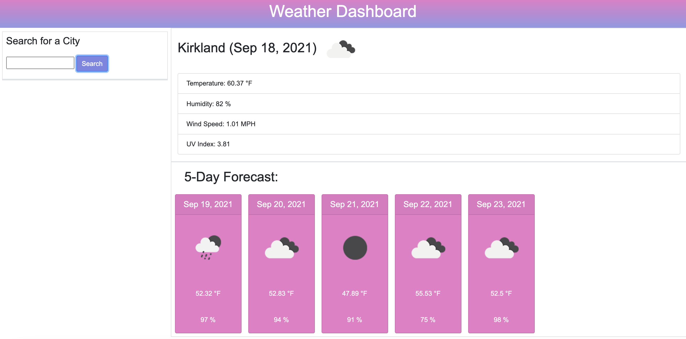

# weatherdashboard

## Description

Create a weather dashboard, so when you are traveling you can check the weather of the city you are going to along with the 5 day forecast. It will inlcude the current date, temperature, humidity, wind speed and UV index. The 5 day report will also include this information.

## Installation

Website can be accessed through my Gitlab profile via URL.

## Usage

Website can be viewed on desktop and meets all standards for accessibility.
link: https://taylorpaddock.github.io/weatherdashboard/

## Credits

Used information from:
https://openweathermap.org/api
https://www.youtube.com/watch?v=GXrDEA3SIOQ

## How to Contribute

Update functionality to show more than just 5 day forecast. Be able to store the data to local storage so you can come back and look at the cities you saved.

Add a clear button to get rid of the cities you no longer want.